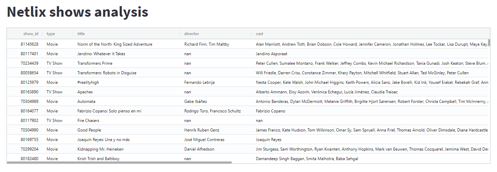
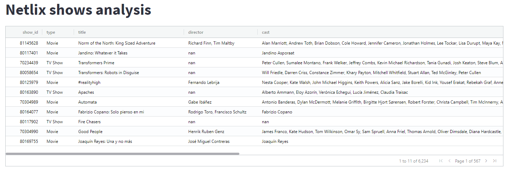
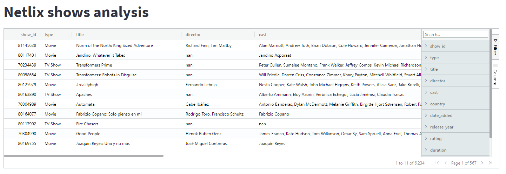
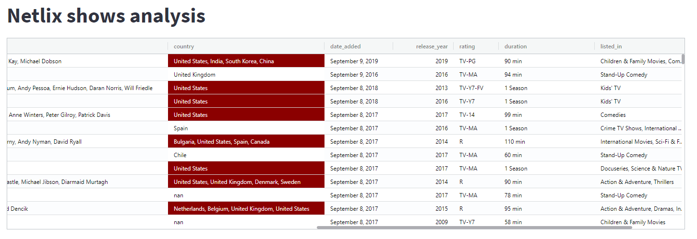
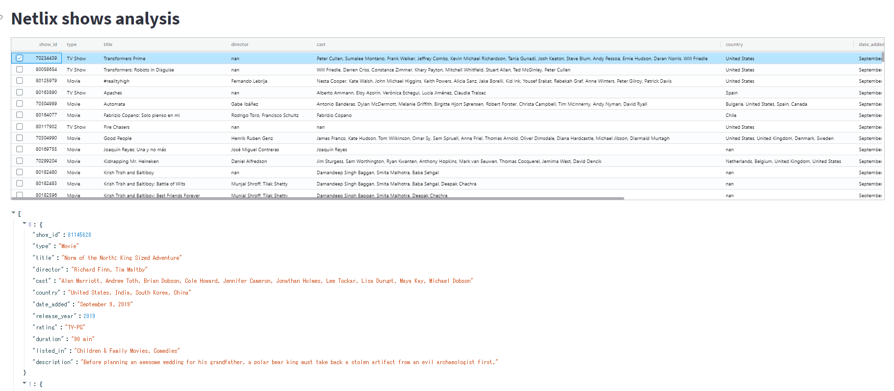
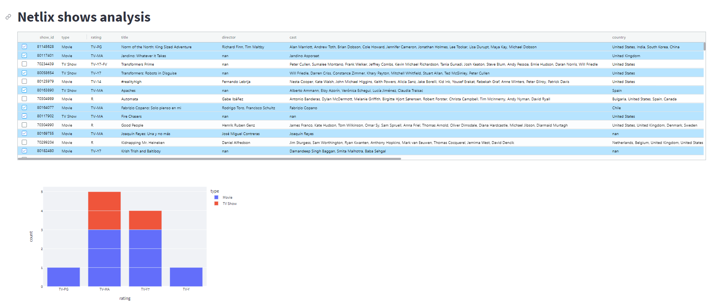

# StreamlitでPandasをインタラクティブに操作


### はじめに

PandasをインタラクティブにStrimlitで操作するstreamlit-aggridのモジュールの解説記事を見つけました。[StreamlitAgGridコンポーネントを使用する必要がある7つの理由](https://ichi.pro/streamlitaggrid-konpo-nento-o-shiyosuru-hitsuyo-ga-aru-7-tsu-no-riyu-50140176855792)の記事の補足説明です。


参考

[Stremlit公式](https://streamlit.io/)

全般的な使い方

[streamlit勉強会【オンライン】 ](https://fin-py.connpass.com/event/201708/)

[20210215_streamlit勉強会](https://docs.google.com/presentation/d/1ZpEnnSEz3YKxDPuolOdzkbBFw2bG4BtT-Ln-TQALtGQ/edit#slide=id.gbb710844bd_0_21)


いろいろな使い方（streamlit-aggridの紹介あり）

[Streamlitの使い方の細かいところ](https://zenn.dev/ohtaman/articles/streamlit_tips)


### 環境

windows 10

python3.8

anaconda

必要モジュール（私の場合は、できるだけcondaでインストール）

streamlit、pandas、plotly、plotly_express、streamlit-aggrid

```powershell
conda install -c conda-forge streamlit, plotly

pip install streamlit-aggrid, plotly_express
```


### 起動・停止方法

起動：streamlit run ファイル名.py

デフォルトでは 8501 ポートで Streamlit のアプリケーションサーバが起動する。

open http://localhost:8501

停止：ctl + c


### コード

[StreamlitAgGridコンポーネントを使用する必要がある7つの理由](https://ichi.pro/streamlitaggrid-konpo-nento-o-shiyosuru-hitsuyo-ga-aru-7-tsu-no-riyu-50140176855792)の記事の補足説明です。

使われているデータのダウンロードについては、**netflix_titles.csv**と検索するといくつか出てきますが、

こちらのサイトのデータを利用しました。

https://github.com/prasertcbs/basic-dataset/blob/master/netflix_titles.csv


#### （1）スクロール、列の並べ替え、検索、フィルタリング

このCSVデータをpandasで読み込み、インタラクティブに操作するコードです。
Webページにある（aggrid_1-py）の補足

Pandasのデータフレームのスクロール、列の並べ替え、検索、フィルタリングが可能です。

```python
# tut_1.py
import pandas as pd 
import streamlit as st 
from st_aggrid import AgGrid

st.set_page_config(page_title="Netflix Shows", layout="wide") 
st.title("Netlix shows analysis")

#　csvが保存されているパスを指定する
shows = pd.read_csv("netflix_titles.csv")  

AgGrid(shows)
```



#### （2）ページによる操作

レコードのスクロールをページ付けにするコード。表の右下にページを変える矢印が付きます。Webページ（aggrid_4-py）の補足。

```python
# tut_2.py
import pandas as pd
import streamlit as st
from st_aggrid import AgGrid
from st_aggrid.grid_options_builder import GridOptionsBuilder

st.set_page_config(page_title="Netflix Shows", layout="wide") 
st.title("Netlix shows analysis")

shows = pd.read_csv("netflix_titles.csv")

# ---
gb = GridOptionsBuilder.from_dataframe(shows)
gb.configure_pagination()
gridOptions = gb.build()

AgGrid(shows, gridOptions=gridOptions)
```



#### （3）列の固定、グループ化、集計

列を固定、グループ化、および集約するコード。データフレームの右端に、列のフィルタリング、ピボットテーブルの実行、またはグループ化と集計（平均または合計）操作に使用できるサイドバーが付きます。Webページ（aggrid_5-py）の補足。

```python
# tut_3.py
import pandas as pd
import streamlit as st
from st_aggrid import AgGrid
from st_aggrid.grid_options_builder import GridOptionsBuilder

st.set_page_config(page_title="Netflix Shows", layout="wide") 
st.title("Netlix shows analysis")

shows = pd.read_csv("netflix_titles.csv")
gb = GridOptionsBuilder.from_dataframe(shows)

# ---
gb.configure_pagination()
gb.configure_side_bar()
gb.configure_default_column(groupable=True, value=True, enableRowGroup=True, aggFunc="sum", editable=True)
gridOptions = gb.build()

AgGrid(shows, gridOptions=gridOptions, enable_enterprise_modules=True)
```



#### （4）セルの強調、スタイル設定

セルの値に応じてスタイルを設定するコード。country値に「UnitedStates」が含まれている場合に列の背景色を変更して、アメリカのテレビ番組や映画番組を強調表示します。Webページ（aggrid_6-py）の補足。

参考にしたWebページでは変更された場所のみ記載されているので、ここでは省略せずに記載します。

```python
# tut_4.py
import pandas as pd
import streamlit as st
from st_aggrid import AgGrid
from st_aggrid.grid_options_builder import GridOptionsBuilder

# add
from st_aggrid.shared import JsCode

st.set_page_config(page_title="Netflix Shows", layout="wide") 
st.title("Netlix shows analysis")

shows = pd.read_csv("netflix_titles.csv")
gb = GridOptionsBuilder.from_dataframe(shows)

# ---

cellsytle_jscode = JsCode(
    """
function(params) {
    if (params.value.includes('United States')) {
        return {
            'color': 'white',
            'backgroundColor': 'darkred'
        }
    } else {
        return {
            'color': 'black',
            'backgroundColor': 'white'
        }
    }
};
"""
)

gb.configure_column("country", cellStyle=cellsytle_jscode)

gridOptions = gb.build()

data = AgGrid(
    shows,
    gridOptions=gridOptions,
    enable_enterprise_modules=True,
    allow_unsafe_jscode=True
)

```



#### （5）1行または複数行の選択と選択行の追加処理

列の並べ替え、1行または複数行のチェックボックスのチェック、手動での値の変更などをキャプチャして、Streamlitアプリのグローバルレイアウトを変更することができます。(aggrid_7_1.py 、aggrid_7_2.py )

1つまたは複数の行が選択すると、選択した行の内容が表の下に出力されます。

```python
# tut_5.py
import pandas as pd
import streamlit as st
from st_aggrid import AgGrid
from st_aggrid.grid_options_builder import GridOptionsBuilder
#add
from st_aggrid.shared import GridUpdateMode

st.set_page_config(page_title="Netflix Shows", layout="wide") 
st.title("Netlix shows analysis")

shows = pd.read_csv("netflix_titles.csv")
gb = GridOptionsBuilder.from_dataframe(shows)

# ---
gb.configure_selection(selection_mode="multiple", use_checkbox=True)

gridOptions = gb.build()


data = AgGrid(shows, 
              gridOptions=gridOptions, 
              enable_enterprise_modules=True, 
              allow_unsafe_jscode=True, 
              update_mode=GridUpdateMode.SELECTION_CHANGED)

st.write(data["selected_rows"])
```



複数の行を選択し、新しい行を選択するたびに、番組の種類（映画/テレビ番組）ごとにグループ化された番組の評価の更新されたヒストグラムが表示されます。

```python
# tut_6.py
from audioop import add
import pandas as pd
import streamlit as st
from st_aggrid import AgGrid
from st_aggrid.grid_options_builder import GridOptionsBuilder
#add
from st_aggrid.shared import GridUpdateMode

st.set_page_config(page_title="Netflix Shows", layout="wide") 
st.title("Netlix shows analysis")

shows = pd.read_csv("netflix_titles.csv")
gb = GridOptionsBuilder.from_dataframe(shows)

# ---
gb.configure_selection(selection_mode="multiple", use_checkbox=True)

gridOptions = gb.build()


data = AgGrid(shows, 
              gridOptions=gridOptions, 
              enable_enterprise_modules=True, 
              allow_unsafe_jscode=True, 
              update_mode=GridUpdateMode.SELECTION_CHANGED)

# st.write(data["selected_rows"])

# add
import plotly_express as px

selected_rows = data["selected_rows"]
selected_rows = pd.DataFrame(selected_rows)

if len(selected_rows) != 0:
    fig = px.bar(selected_rows, "rating", color="type")
    st.plotly_chart(fig)
```




### 感想・まとめ

streamlit-aggridは、Streamlit内でPandasのDataFrameをインタラクティブに扱えます。ここにあるプログラムを参考に、自分なりのデータベース検索Webアプリを作ってみようと思います。

公式ページの[Components]([Components • Streamlit](https://streamlit.io/components))に有用なモジュールが紹介されています。

